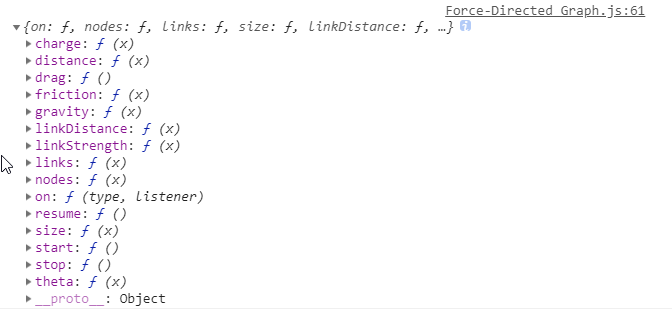

学习d3的网站
https://beta.observablehq.com/@mbostock/d3-force-directed-graph

### 3. Force-Directed Graph

Force-Directed Graph数据转换的layout得到的结果。

```JavaScript
var force = d3.layout.force()
    .nodes(renodes)
    .links(dataset.edges)
    .size([width, height])
    .linkDistance(90)
    .charge(-400);

console.log(force);
```
可以看到force的数据结构


force.on传递进去的数据d的格式
```
{source: {…}, target: {…}, weight: 1}
source: {name: 0, index: 0, weight: 4, x: 282.84751434169624, y: 264.2339281904951, …}
target: {name: 1, index: 1, weight: 2, x: 291.70204873490945, y: 167.100827472662, …}
weight: 1
__proto__: Object
```
